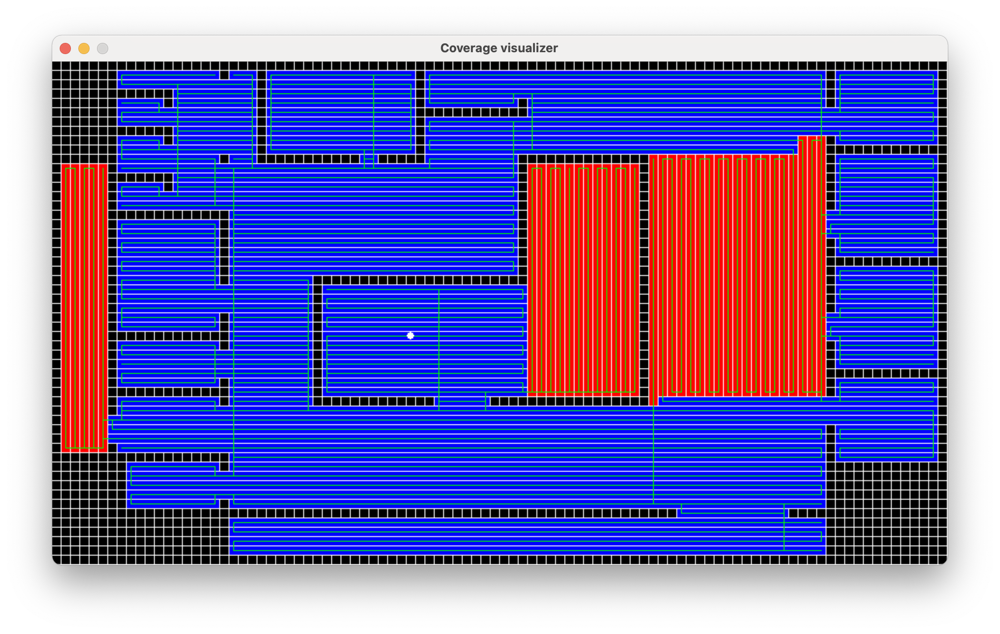

# Coverage Path Planning
## Description

The coverage path planning problem refers to the task of determining an optimal path for an autonomous agent to navigate through an area, ensuring that the entire area is covered. This problem is commonly encountered in various domains, including robotics, agriculture, cleaning operations, and surveillance.

The objective of coverage path planning is to systematically visit all points or regions of interest within the area while minimizing travel distance.

The presented algorithm operates under the assumption that the region is partitioned into square cells, where each cell can be classified as either an obstacle or an open space. The autonomous agent is restricted to moving in a manner parallel to the grid lines, without any additional time required for turning.

<p align="center">
  
</p>

## Getting Started

These instructions will get you a copy of the project up and running on your local machine for development and testing purposes.

### Prerequisites

**[CMake](https://cmake.org/)** &mdash; an open-source, cross-platform family of tools designed to build, test and package software.

**[OR Tools](https://developers.google.com/optimization)** &mdash; a fast and portable software for combinatorial optimization.

**[Pygame](https://pygame.org/)** &mdash; a computer graphics and sound libraries designed to be used with the Python.

### Installing

Download current repository to your local machine. Use
```bash
git clone https://github.com/NDamirov/CoverageProblem.git
```
or direct downloading.

Built current project using **CMake**.
```bash
cmake -B build
cmake --build build 
```

## Input and Output files

The input file should consist of a table of symbols representing the area to be covered. In this table, the `#` symbol indicates an obstacle, while the `*` symbol represents a free space. Each symbol corresponds to a square cell in the coverage region.

The output file consists of a table of symbols representing the area to be covered. In this table, the `#` symbol indicates an obstacle, while the `|` and `-` symbols represent vertical and horizontal ranks respectively. It also may have path of agent if needed.

## Launch

### Algorithm

To launch an application you need to have input file:

```bash
./build/CoverageProblem input.txt output.txt
```

#### Extra options:

`--ranks_only` &mdash; if you need only ranks decomposition without path generation.

`--slow` &mdash; if you want to use more effective slow algorithms (A-Star instead of Manhattan distance).

### Visualizer

Just path the output file to visualizer:

```bash
python3 visualizer/visualizer.py output.txt
```